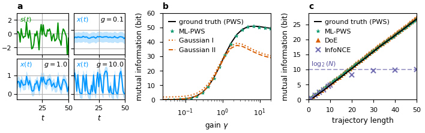

# ML-PWS: Machine Learning Implementation of Path Weight Sampling


[](https://arxiv.org/abs/2508.16509)
[](https://mybinder.org/v2/gh/manuel-rhdt/ml-pws/HEAD)

ML-PWS is a Python package that implements Path Weight Sampling (PWS) models for time series analysis. It provides tools for computing mutual information in sequential data using autoregressive models and Monte Carlo Sampling, built with JAX, Flax, and PyTorch.

## Overview

This package implements the ML-PWS method introduced in [arXiv:2508.16509](https://arxiv.org/abs/2508.16509), which combines machine learning with Path Weight Sampling to estimate mutual information rates from experimental time-series data without requiring explicit mathematical models of the underlying dynamics.

### Problem Statement

Computing information transmission rates I(S;X) between time-varying signals S (input) and X (output) is fundamental for understanding information processing in dynamical systems, yet remains computationally intractable for most real-world scenarios due to the high dimensionality of trajectory spaces. Traditional PWS requires analytical models of the system dynamics, limiting applicability to experimental data where such models are unavailable.

### Key Innovation

ML-PWS learns a generative surrogate model from experimental time-series data using neural networks (LSTM + normalizing flows), then applies the Path Weight Sampling algorithm to this learned model to obtain information transmission rates. By inferring the model from data rather than requiring it a priori, this approach extends PWS to systems where explicit analytical dynamics are unknown.

## Installation

### Prerequisites

- Python 3.11 or higher

### Installing with conda

1. Install the conda environment:
```bash
conda env create -f environment.yml
```

2. Activate the environment
```bash
conda activate ml-pws
```

### Installing with uv

1. First, install uv if you haven't already:
```bash
curl -LsSf https://astral.sh/uv/install.sh | sh
```

2. Clone the repository:
```bash
git clone https://github.com/manuel-rhdt/ml-pws.git
cd ml-pws
```

3. Create and activate a new virtual environment with uv:
```bash
uv venv
source .venv/bin/activate  # On Unix/macOS
# or
.venv\Scripts\activate  # On Windows
```

4. Install the package and its dependencies:
```bash
uv pip install -e .
```

## Technical Methodology

### Mutual Information Estimation

The mutual information between input trajectories **s** = (s₁, ..., sₜ) and output trajectories **x** = (x₁, ..., xₜ) is defined as:

```
I(S;X) = E[log p(x|s)] - E[log p(x)]
       = E[log p(x|s) - log p(x)]
```

where the expectation is over the joint distribution p(s,x). The key computational challenge is evaluating the marginal log-likelihood log p(x) for long trajectories.

### Path Weight Sampling Framework

ML-PWS uses Sequential Monte Carlo (SMC) to estimate log p(x) via importance sampling with N particles:

```
log p(x) ≈ log (1/N) Σᵢ wᵢ
```

where particle weights are computed incrementally as:

```
log wᵢ(t) = log wᵢ(t-1) + log p(xₜ|sᵢ,t) - KL(q(sᵢ,t|x₁:t) || p(sᵢ,t|s₁:t₋₁))
```

### Three-Component Neural Architecture

The implementation comprises three learned models:

#### 1. Forward Model (Input Model)
- **Architecture**: AR(p) autoregressive process with Gaussian noise
- **Purpose**: Models input dynamics p(sₜ | s₁:t₋₁)
- **Implementation**: `ARCell` in `ml_pws/models/ar_model.py`
- **Parameters**:
  - AR coefficients φ = (φ₁, ..., φₚ)
  - Noise standard deviation σ
- **Equation**: sₜ = Σⱼ φⱼ sₜ₋ⱼ + εₜ, where εₜ ~ N(0, σ²)

#### 2. Variational Model (Backward Model)
- **Architecture**: LSTM + normalizing flow (affine/coupling transforms)
- **Purpose**: Approximates posterior q(sₜ | x₁:t) for variance reduction
- **Implementation**: `FlowRNNCell` in `ml_pws/models/variational_rnn.py`
- **Transform**: Uses mixture of logistics coupling function from Flow++
  - Hidden size: 16 units (default)
  - Base distribution: Standard Gaussian ε ~ N(0,1)
  - Output: (log |det J|, sₜ) where J is Jacobian of flow
- **KL Divergence**: KL = log q(s|x) - log p(s|history)

#### 3. Output Model (Predictive Model)
- **Architecture**: LSTM-based conditional Gaussian model
- **Purpose**: Models conditional distribution p(xₜ | sₜ, x₁:t₋₁)
- **Implementation**: `PredictiveCell` in `ml_pws/models/predictive_rnn.py`
- **Network Structure**:
  - Input: [sₜ, xₜ₋₁] → Linear(2, hidden_size)
  - LSTM cell with hidden state dimension = hidden_size (default: 64)
  - Output head: Linear(hidden_size, 2) → [μₜ, log σₜ²]
- **Log-likelihood**: log p(xₜ|sₜ) = log N(xₜ; μₜ, σₜ²)

### Sequential Monte Carlo Algorithm

The `SMCEstimator` class (`ml_pws/models/smc_estimator.py`) implements the core SMC loop:

1. **Initialization**: N particles with uniform weights log wᵢ = 0
2. **For each timestep t**:
   - Sample εᵢ ~ N(0,1)
   - Transform via variational flow: sᵢ,t ~ q(·|x₁:t), compute log |det J|
   - Evaluate log p(sᵢ,t | sᵢ,₁:t₋₁) using forward model
   - Evaluate log p(xₜ | sᵢ,t) using output model
   - Update weights: log wᵢ ← log wᵢ + log p(xₜ|sᵢ,t) - KL
   - **Adaptive resampling**: If ESS < N/2, resample particles
     - ESS = 1 / Σᵢ (normalized wᵢ)²
     - Categorical resampling from softmax(log wᵢ)
     - Reset weights to uniform after resampling
3. **Final estimate**: log p(x) = log Σᵢ exp(log wᵢ) - log N

### Training Procedure

Training occurs in two stages:

#### Stage 1: Forward Model Training
- **Objective**: Maximize conditional log-likelihood E[log p(x|s)]
- **Loss function**: -mean(log p(x|s) over trajectories)
- **Optimizer**: AdamW with learning rate 1e-3
- **Trainable parameters**: Output cell only (variational cell frozen)
- **Default epochs**: 100
- **Implementation**: `train_forward_model()` in `smc_estimator.py:202`

#### Stage 2: Backward Model Training
- **Objective**: Maximize ELBO (Evidence Lower BOund)
- **Loss function**:
  ```
  L = -E[log p(x|s) - KL(q(s|x) || p(s))]
  ```
  where:
  - log p(x|s): conditional likelihood from output cell
  - KL = log q(s|x) - log p(s): divergence between variational and input models
- **Optimizer**: AdamW with learning rate 1e-2
- **Trainable parameters**: Variational cell only (forward/output cells frozen)
- **Default epochs**: 200
- **Implementation**: `train_backward_model()` in `smc_estimator.py:258`

### MI Estimation

Final mutual information is computed as:
```
I(S;X) = E[log p(x|s) - log p(x)]
```

where:
- log p(x|s): Obtained by running output model forward (exact evaluation)
- log p(x): Estimated via SMC with N=512 particles (default)

The estimator returns MI estimates at each timestep, enabling analysis of information accumulation dynamics.

### Comparison Methods

The package also implements baseline estimators for comparison:

1. **Classical PWS**: Requires known analytical model (ground truth for validation)
2. **InfoNCE**: Contrastive learning approach (`ml_pws/models/contrastive_mi.py`)
   - Uses Conv1D discriminator network
   - Optimizes noise-contrastive estimation objective
3. **DoE (Difference of Entropies)**: Alternative neural MI estimator

## Applications

### Synthetic Data Validation

The method is validated on synthetic datasets where ground truth MI can be computed analytically:

- **Gaussian AR processes**: Linear autoregressive models with known covariance structure
- **Nonlinear dynamics**: Systems with non-Gaussian coupling
- **Parameter sweeps**: Varying gain, noise levels, and trajectory lengths to assess estimator performance

Results demonstrate ML-PWS can accurately recover ground truth MI values obtained from analytical models (PWS, Gaussian) by learning surrogate models from data alone.

### Biological Neural Data

The package includes pre-trained models for analyzing Drosophila visual system neurons:

- **Dataset**: Retinal spike recordings from 50 neurons responding to visual stimuli
  - Source: Marre et al. (2015) neurophysiology experiments
  - Data file: `data/barmovie0113extended.data` (9.1 MB)
- **Model Architecture**: PyTorch Lightning + SDE-based dynamics
  - Individual models: `models/neuron_0.pth` through `models/neuron_49.pth`
  - Ensemble model: `models/neurons_range(50).pth`
- **Training**: `scripts/neurons/train_models.py` with real spike train data
- **Analysis**: Notebooks in `notebooks/06_neuron-data.ipynb` demonstrate MI estimation for biological time-series

This application showcases ML-PWS capability to estimate information transmission rates in experimental neuroscience data by learning neural response models directly from spike recordings.

## Usage

The package provides several scripts to recreate the figures from the paper:

1. Regenerate figure datasets:
```bash
make data
```

2. Scripts to generate figures are in the `scripts` directory. You can create Figure 1 from the publication using
```bash
make figures
```
which will save the figure in `reports/figures`.


## Project Structure

```
ml-pws/
├── ml_pws/                      # Core package
│   ├── data/                    # Dataset generators
│   │   ├── make_gaussian_dataset.py
│   │   └── nonlinear_dataset.py
│   └── models/                  # Model implementations
│       ├── ar_model.py          # AR(p) forward model
│       ├── smc_estimator.py     # SMC algorithm + training
│       ├── variational_rnn.py   # Normalizing flow (backward model)
│       ├── predictive_rnn.py    # LSTM output model
│       ├── contrastive_mi.py    # InfoNCE baseline
│       ├── gaussian_rnn.py      # DoE estimator
│       └── trainer.py           # PyTorch Lightning utilities
├── scripts/                     # Reproducible experiments
│   ├── 01-ar_dataset.py         # Generate synthetic data
│   ├── 05-ar_input_mlpws.py     # Main comparison experiment
│   ├── figure1.py               # Publication figure generation
│   └── neurons/                 # Neuron model training
├── experiments/                 # Results organized by method
│   ├── pws/                     # Classical PWS (ground truth)
│   ├── mlpws/                   # ML-PWS results
│   ├── infonce/                 # InfoNCE results
│   └── doe/                     # DoE results
├── models/                      # Pre-trained PyTorch models
│   ├── neuron_*.pth             # Individual neuron models (50 total)
│   └── neurons_range(50).pth    # Ensemble model
├── data/                        # Example datasets
│   ├── ar_data*.json            # AR time series
│   ├── trajectories.json        # Example trajectories
│   ├── 03-nonlinear.db          # Nonlinear experiment database
│   └── barmovie0113extended.data # Drosophila neuron recordings
├── notebooks/                   # Analysis notebooks
│   ├── 06_neuron-data.ipynb     # Neuron data analysis
│   └── 07_model_comparisons.ipynb # Method comparisons
└── reports/figures/             # Generated publication figures
```

## Key Results

From the publication and included experiments:

### Method Comparison

The package compares five MI estimation approaches:

1. **PWS** (Classical): Ground truth using known analytical model
2. **ML-PWS** (This work): Learns neural surrogate model from data, then applies PWS
3. **InfoNCE**: Contrastive learning with discriminator network
4. **DoE**: Domain-of-Experts neural estimator
5. **Gaussian**: Analytical solution for Gaussian systems (ground truth baseline)

### Performance Characteristics

- **Model Learning**: ML-PWS successfully learns surrogate generative models from time-series data, enabling PWS application without analytical models
- **Variance Reduction**: Normalizing flow variational model (backward model) substantially reduces estimator variance
- **Long Trajectories**: Handles sequences of 100+ timesteps where direct marginal likelihood computation is intractable
- **Adaptive Resampling**: ESS-based resampling (threshold N/2) maintains particle diversity while minimizing computational overhead
- **Biological Data**: Successfully estimates information transmission in Drosophila visual neuron recordings (50 neurons analyzed)

## Dependencies

- clu >= 0.0.12
- flax >= 0.11.2
- jax >= 0.7.2
- lightning >= 2.5.5
- matplotlib >= 3.10.6
- numpy >= 2.0.2
- polars >= 1.33.1
- scipy >= 1.16.2
- tensorflow >= 2.20.0
- torch >= 2.8.0
- tqdm >= 4.67.1

## License

This project is licensed under the MIT License - see the [LICENSE](LICENSE) file for details.

## Author

Manuel Reinhardt ([@manuel-rhdt](https://github.com/manuel-rhdt))
